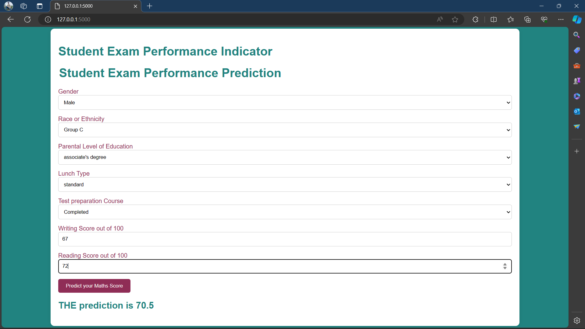

# Student Performance Prediction

This repository contains the code and resources for an end-to-end machine learning project aimed at predicting student performance.

## Preview


## Overview

The project focuses on predicting student performance using machine learning techniques. It involves several stages including data ingestion, transformation, model selection, training, evaluation, and deployment.

## Dataset

The dataset used for this project contains various features related to students' demographics, study habits, and academic performance. It includes attributes such as student's gender, parental education level, ethnicity, exam scores, etc.

## Project Structure

The project is structured as follows:

- `notebook/data/`: Directory containing the dataset used for training and testing.
- `notebook/`: Jupyter notebooks for data exploration, preprocessing, model training, and evaluation.
- `src`: Source code for exception handling, logging and necessary utils used for the project
- `src/components`: Source code for data preprocessing, model training, and evaluation.
- `src/pipeline`: Pipeline used for predection 
- `requirements.txt`: File containing the necessary dependencies to run the project.
- `templates`: Contains necessary file to run the Flask app.

## Getting Started

To get started with the project, follow these steps:

1. Clone this repository to your local machine.
2. Install the required dependencies using 
    ```bash
    pip install -r requirements.txt
3. Explore the Jupyter notebooks in the `notebooks/` directory to understand the data and the machine learning pipeline.
4. Run the scripts in the `src/components` directory for data ingestion, data transformation and model training.

## Usage

- **Flask App**: 
    ```bash
    python app.py
then navigate to http://127.0.0.1:5000 to run the app in the local browser  

## Contributing

Contributions are welcome! If you'd like to contribute to this project, feel free to submit a pull request.